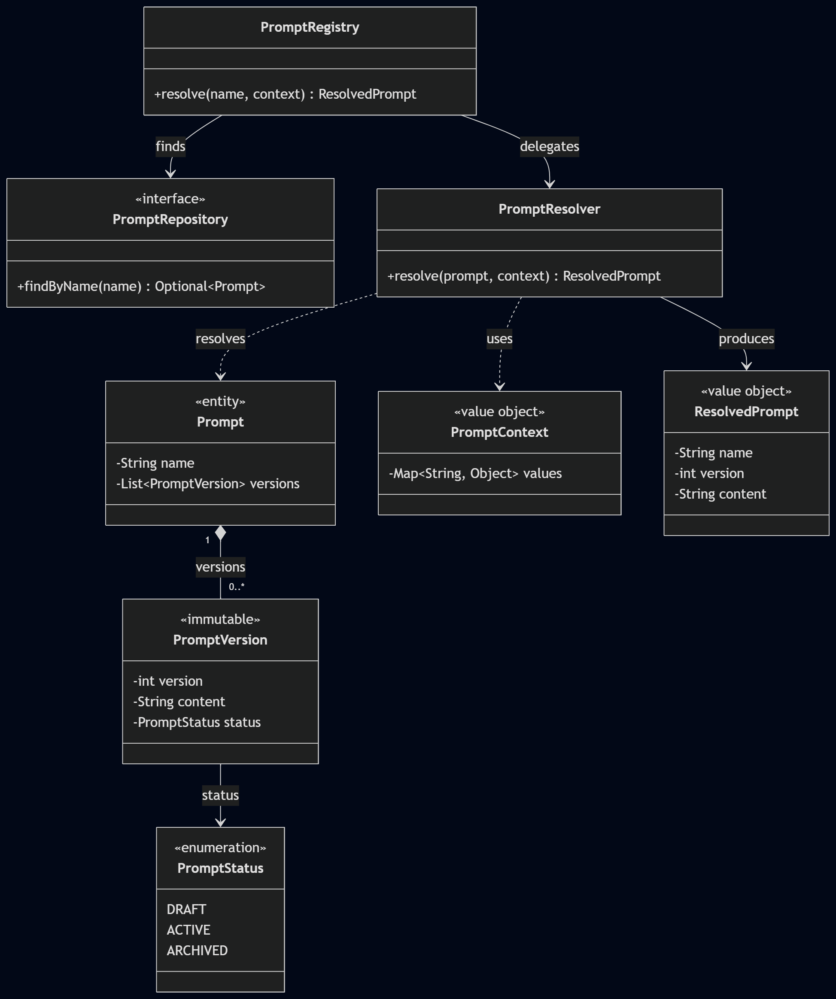

# prompt-core

`prompt-core` is the pure Java foundation of the Prompt Registry
framework.

It provides the domain model, repository abstraction, in-memory
repository, and deterministic runtime resolution needed to resolve
versioned prompts without coupling the core to any application framework
or infrastructure technology.

The module is intentionally framework-independent. It has no dependency
on Spring, Spring Boot, Spring AI, Redis, JDBC, PostgreSQL, or any LLM
provider.

## Responsibilities

The current `prompt-core` module is responsible for:

-   Representing prompts and their versions
-   Representing prompt lifecycle status
-   Carrying runtime resolution context
-   Providing the prompt repository abstraction
-   Providing an in-memory repository implementation
-   Resolving the active prompt version
-   Returning a `ResolvedPrompt`
-   Validating invalid input and invalid prompt state

The module is **not** responsible for:

-   Database persistence
-   PostgreSQL or JDBC
-   Redis or caching
-   Spring integration
-   Spring Boot auto-configuration
-   Spring AI or LLM invocation
-   Prompt template substitution
-   Canary or rollout strategies
-   Observability infrastructure
-   Authorization

Those concerns belong to later modules or integration layers.

## Architecture

The current resolution flow is:

``` text
Java Application
       |
       | resolve(name, context)
       v
PromptRegistry
       |
       | findByName(name)
       v
PromptRepository
       |
       | Prompt
       v
PromptResolver
       |
       | active version
       v
ResolvedPrompt
```

The important architectural boundary is that `PromptRegistry` does not
know how prompts are persisted, and `PromptResolver` does not know about
databases, Spring, AI providers, or other infrastructure.

## Package Structure

``` text
io.github.devadigaakash777.promptregistry.core
├── domain
│   ├── Prompt
│   ├── PromptContext
│   ├── PromptStatus
│   ├── PromptVersion
│   └── ResolvedPrompt
│
├── exception
│   ├── InvalidPromptNameException
│   ├── InvalidPromptStateException
│   ├── NoActivePromptVersionException
│   └── PromptNotFoundException
│
├── registry
│   └── PromptRegistry
│
├── repository
│   ├── PromptRepository
│   └── memory
│       └── InMemoryPromptRepository
│
└── resolution
    └── PromptResolver
```

## Domain Model

### Prompt

`Prompt` represents a named prompt and its available versions.

``` java
Prompt prompt = new Prompt(
        "customer-support",
        List.of(
                new PromptVersion(
                        1,
                        "Old prompt",
                        PromptStatus.ARCHIVED
                ),
                new PromptVersion(
                        2,
                        "Active prompt",
                        PromptStatus.ACTIVE
                )
        )
);
```

A `Prompt`:

-   Requires a non-blank name
-   Requires a non-null version list
-   Makes a defensive copy of the supplied versions
-   Rejects null versions
-   Rejects duplicate version numbers
-   Exposes its versions through an immutable list

### PromptVersion

`PromptVersion` represents one immutable version of a prompt.

``` java
PromptVersion version = new PromptVersion(
        2,
        "You are a helpful assistant.",
        PromptStatus.ACTIVE
);
```

It contains:

-   `version`
-   `content`
-   `status`

Validation rules:

-   Version must be greater than zero
-   Content must not be null or blank
-   Status must not be null

A `PromptVersion` has no mutating operations. Historical prompt content
is therefore not changed in place.

### PromptStatus

The current lifecycle statuses are:

``` java
public enum PromptStatus {
    DRAFT,
    ACTIVE,
    ARCHIVED
}
```

`PromptResolver` currently uses `ACTIVE` to determine which version can
be resolved.

### PromptContext

`PromptContext` carries runtime values associated with a resolution
request.

``` java
PromptContext context = new PromptContext(
        Map.of(
                "customer", "John",
                "question", "How do I reset my password?"
        )
);
```

The current implementation stores the supplied values as an immutable
copy.

The context is already part of the resolution API even though the
current resolver does not perform template substitution or
context-dependent version selection.

This keeps the public API suitable for future resolution capabilities
without adding those concerns to the current core milestone.

### ResolvedPrompt

`ResolvedPrompt` represents the result of successful prompt resolution.

``` java
ResolvedPrompt resolvedPrompt = new ResolvedPrompt(
        "customer-support",
        2,
        "You are an expert customer support assistant."
);
```

It contains:

-   Prompt name
-   Selected version
-   Resolved content

`ResolvedPrompt` is implemented as a Java record and validates its
required state.

## Repository Abstraction

The core separates resolution from persistence through
`PromptRepository`:

``` java
public interface PromptRepository {

    Optional<Prompt> findByName(String name);
}
```

The registry depends on this abstraction rather than on a concrete
storage technology.

The current implementation is:

``` text
PromptRegistry
      |
      v
PromptRepository
      |
      v
InMemoryPromptRepository
```

A future PostgreSQL/JDBC implementation can provide the repository
without requiring changes to the core resolution model.

## In-Memory Repository

`InMemoryPromptRepository` provides the current in-memory implementation
of `PromptRepository`.

``` java
PromptRepository repository =
        new InMemoryPromptRepository(
                List.of(prompt)
        );
```

The repository:

-   Stores prompts by name
-   Uses `ConcurrentHashMap` internally
-   Rejects a null prompt collection
-   Rejects null prompt entries
-   Rejects duplicate prompt names
-   Returns `Optional.empty()` when a prompt is not found
-   Does not currently expose write operations

The in-memory repository is intentionally small. Its purpose is to prove
and test the core architecture before external persistence is
introduced.

## Prompt Registry

`PromptRegistry` is the application-facing entry point for runtime
prompt resolution.

Its primary operation is:

``` java
ResolvedPrompt resolve(
        String name,
        PromptContext context
);
```

The registry coordinates:

1.  Prompt name validation
2.  Repository lookup
3.  Prompt resolution
4.  Propagation of resolution failures

The registry does not contain version-selection logic itself. That
responsibility belongs to `PromptResolver`.

## Prompt Resolution

`PromptResolver` is responsible for selecting the active version from a
`Prompt`.

The current deterministic rule is:

``` text
0 ACTIVE versions
        -> NoActivePromptVersionException

1 ACTIVE version
        -> Resolve that version

2+ ACTIVE versions
        -> InvalidPromptStateException
```

For example:

``` text
Prompt: customer-support

v1 -> ARCHIVED
v2 -> ACTIVE
v3 -> DRAFT

Result:
v2
```

The resolver deliberately does not silently choose the highest version,
first version, or another arbitrary candidate when the prompt is in an
invalid state.

This makes inconsistent configuration explicit instead of hiding it.

## Resolution Activity Diagram


The activity flow is:

``` text
Validate prompt name
        |
        v
Find prompt by name
        |
        +---- not found ----> PromptNotFoundException
        |
        v
Find ACTIVE versions
        |
        +---- 0 -----------> NoActivePromptVersionException
        |
        +---- 1 -----------> Create ResolvedPrompt
        |
        +---- 2 or more ---> InvalidPromptStateException
```

## Class Diagram



The class diagram shows the main relationships between:

-   `PromptRegistry`
-   `PromptRepository`
-   `PromptResolver`
-   `Prompt`
-   `PromptVersion`
-   `PromptStatus`
-   `PromptContext`
-   `ResolvedPrompt`

The key architectural relationship is that `PromptRegistry` coordinates
repository access and delegates version selection to `PromptResolver`.

## Use Case Diagram


The current primary use case is:

``` text
Java Application
       |
       | resolve(name, context)
       v
   prompt-core
       |
       v
  Resolve Prompt
```

## Sequence Diagram


The resolution interaction is:

``` text
Java Application
       |
       | resolve(name, context)
       v
PromptRegistry
       |
       | validate name
       |
       | findByName(name)
       v
PromptRepository
       |
       | Prompt
       v
PromptRegistry
       |
       | resolve(prompt, context)
       v
PromptResolver
       |
       | find ACTIVE versions
       |
       +---- none -------> NoActivePromptVersionException
       |
       +---- one --------> ResolvedPrompt
       |
       +---- multiple ---> InvalidPromptStateException
```

## Error Handling

The module defines explicit exceptions for invalid requests and invalid
prompt state.

### InvalidPromptNameException

Thrown when a registry resolution request contains a null or blank
prompt name.

``` java
registry.resolve(" ", context);
```

### PromptNotFoundException

Thrown when the repository cannot find the requested prompt.

``` java
registry.resolve("unknown-prompt", context);
```

### NoActivePromptVersionException

Thrown when the requested prompt exists but has no `ACTIVE` version.

``` text
v1 -> DRAFT
v2 -> ARCHIVED
```

### InvalidPromptStateException

Thrown when more than one `ACTIVE` version exists for the same prompt.

``` text
v1 -> ACTIVE
v2 -> ACTIVE
```

The resolver intentionally treats this as invalid state rather than
making an implicit selection.

## Immutability

The core uses immutable state for its domain objects:

-   `PromptVersion` is a final class with final fields and no mutating
    operations.
-   `Prompt` defensively copies its version list.
-   `PromptContext` defensively copies its values map.
-   `ResolvedPrompt` is a record.

This prevents callers from changing the prompt model through the
original mutable collections supplied to constructors.

Activation and other lifecycle-management operations are intentionally
outside the current read-only core milestone.

## Thread-Safety

The current domain objects are immutable after construction.

`InMemoryPromptRepository` uses `ConcurrentHashMap` for its internal
prompt storage, making concurrent reads appropriate for its intended
use.

The repository is initialized from the supplied collection during
construction and does not currently expose write operations.

Concurrency concerns involving external persistence, activation,
management operations, cache invalidation, and distributed consistency
are intentionally deferred to later milestones where those concerns
actually exist.

## Example

A complete in-memory resolution example:

``` java
import io.github.devadigaakash777.promptregistry.core.domain.Prompt;
import io.github.devadigaakash777.promptregistry.core.domain.PromptContext;
import io.github.devadigaakash777.promptregistry.core.domain.PromptStatus;
import io.github.devadigaakash777.promptregistry.core.domain.PromptVersion;
import io.github.devadigaakash777.promptregistry.core.domain.ResolvedPrompt;
import io.github.devadigaakash777.promptregistry.core.registry.PromptRegistry;
import io.github.devadigaakash777.promptregistry.core.repository.PromptRepository;
import io.github.devadigaakash777.promptregistry.core.repository.memory.InMemoryPromptRepository;
import io.github.devadigaakash777.promptregistry.core.resolution.PromptResolver;

import java.util.List;
import java.util.Map;

public class Example {

    public static void main(String[] args) {

        Prompt prompt = new Prompt(
                "customer-support",
                List.of(
                        new PromptVersion(
                                1,
                                "You are a helpful assistant.",
                                PromptStatus.ARCHIVED
                        ),
                        new PromptVersion(
                                2,
                                "You are an expert customer support assistant.",
                                PromptStatus.ACTIVE
                        )
                )
        );

        PromptRepository repository =
                new InMemoryPromptRepository(List.of(prompt));

        PromptResolver resolver = new PromptResolver();

        PromptRegistry registry =
                new PromptRegistry(repository, resolver);

        PromptContext context =
                new PromptContext(Map.of());

        ResolvedPrompt resolved =
                registry.resolve(
                        "customer-support",
                        context
                );

        System.out.println(resolved.name());
        System.out.println(resolved.version());
        System.out.println(resolved.content());
    }
}
```

Expected result:

``` text
customer-support
2
You are an expert customer support assistant.
```

## Maven

The module coordinates are currently:

``` xml
<groupId>io.github.devadigaakash777</groupId>
<artifactId>prompt-core</artifactId>
<version>1.0-SNAPSHOT</version>
```

The module currently uses JUnit 5 for testing.

The production code in `prompt-core` has no dependency on Spring, Spring
Boot, Spring AI, Redis, JDBC, PostgreSQL, or an LLM provider.

## Testing

The current test suite contains 32 tests covering the core behavior.

### Domain tests

The domain tests cover:

-   Valid `Prompt`
-   Invalid prompt names
-   Null version collections
-   Null versions
-   Duplicate version numbers
-   Valid `PromptVersion`
-   Non-positive version numbers
-   Blank content
-   Null status
-   Valid `ResolvedPrompt`
-   Invalid resolved prompt state
-   `PromptContext` creation
-   Null context values map
-   Defensive copying of context values

### Repository tests

The repository tests cover:

-   Existing prompt lookup
-   Missing prompt lookup
-   Duplicate prompt names

### Registry tests

The registry tests cover:

-   Successful resolution
-   Invalid prompt names
-   Missing prompts
-   Null resolution context

### Resolver tests

The resolver tests cover:

-   One active version
-   No active version
-   Multiple active versions

The integration-style `InMemoryPromptRegistryTest` verifies the complete
flow using `PromptRegistry`, `InMemoryPromptRepository`, and
`PromptResolver`.

JUnit 5 is used for the test suite.

## Current Limitations

The current implementation intentionally does not provide:

-   Prompt creation or management operations
-   Version activation or archive management operations
-   External persistence
-   PostgreSQL/JDBC storage
-   Cache abstraction
-   Redis
-   Template variable substitution
-   Canary selection
-   Spring annotations
-   Spring interception
-   Spring AI integration
-   LLM invocation
-   Observability
-   Authorization

These capabilities are deliberately deferred to later modules and
milestones.

## Architectural Boundary

The most important rule for this module is:

``` text
prompt-core
    |
    | pure Java domain and resolution logic
    v
No Spring
No Spring Boot
No Spring AI
No Redis
No JDBC
No PostgreSQL
No LLM provider
```

External technologies must integrate with the core through separate
modules and abstractions.

This keeps the Java foundation reusable independently of any particular
application framework or infrastructure choice.

## Next Development Step

The next major milestone is external persistence, beginning with the
storage architecture and PostgreSQL/JDBC implementation.

The core resolution behavior should remain stable while the storage
implementation is introduced.

The PostgreSQL implementation should provide the persistence mechanism
behind the repository abstraction rather than moving database concerns
into `prompt-core`.

## License

License information will be added when the project's licensing decision
is finalized.
